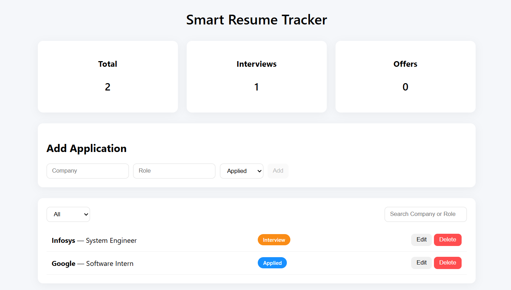
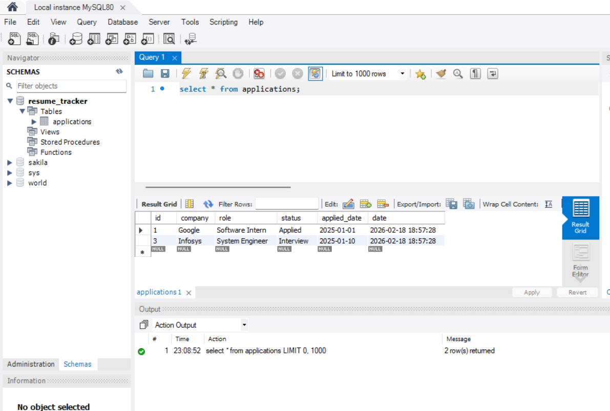

# 📝 Smart Resume Tracker

Smart Resume Tracker is a **full-stack web application** that helps job seekers **track and manage their job applications**. You can add, edit, delete, and filter applications by status, and view a dashboard with summary stats like total applications, interviews, and offers.

## 📸 Screenshots

**Dashboard Overview**  


**Database Overview**  



## ✨ Features

- Add, edit, and delete job applications  
- Filter applications by status: Applied, Interview, Offer, Rejected  
- Search by company or role  
- Dashboard with summary stats: total applications, interviews, offers  
- Status badges for quick visual recognition  
- Backend validation for data consistency  


## 🛠️ Tech Stack

- **Frontend:** React.js, CSS  
- **Backend:** Node.js, Express.js  
- **Database:** MySQL  
- **Libraries:** mysql2, cors  


## ⚡ Installation

1. **Clone the repository**
```bash
git clone https://github.com/yourusername/smart-resume-tracker.git
cd smart-resume-tracker

Setup Backend
cd backend
npm install
node server.js

Setup Frontend
cd ../frontend
npm install
npm start

The app will open in your browser at http://localhost:3000

🚀 Usage
Open the dashboard in your browser.
Add a new application using the form.
Edit or delete existing applications.
Filter applications by status or search by company/role.
Check the dashboard for total applications, interviews, and offers.

🔮 Future Enhancements
Add email notifications for interviews or deadlines
Implement user authentication for multiple users
Add charts or graphs for analytics
Deploy to cloud platforms (Heroku, Vercel, etc.)

📁 Folder Structure
smart-resume-tracker/
├─ backend/          # Node.js server & APIs
├─ frontend/         # React app
├─ screenshots/      # Screenshots for README
└─ README.md

📄 License
MIT License
